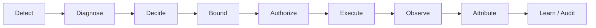
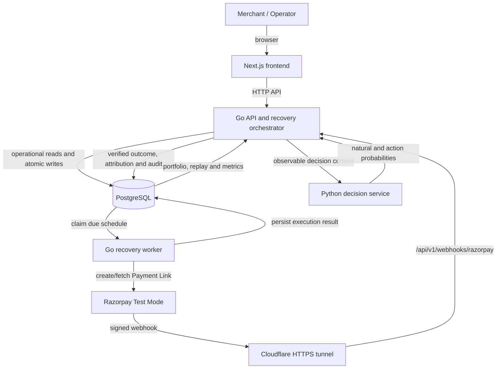
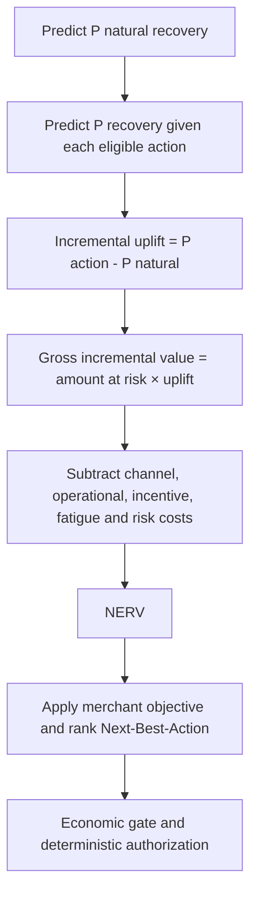
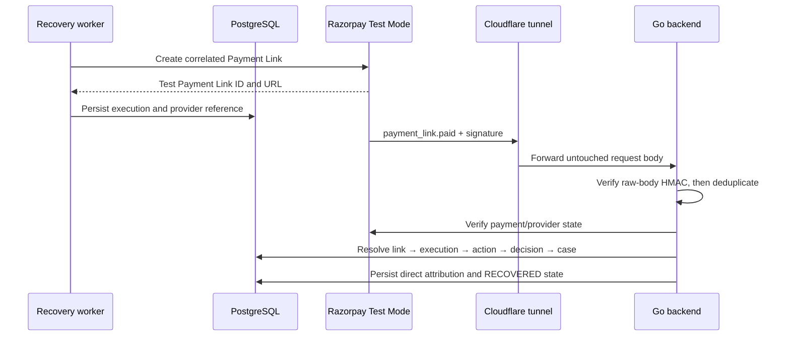

# RevClaim — Explainable AI Revenue Recovery

RevClaim recovers revenue from failed payments and checkout abandonment using explainable Next-Best-Action decisioning, bounded execution, and attributable outcomes.

**Project video:** [Click Link](https://drive.google.com/file/d/13hx38KfSjlnrN0gUNgKQe-a-ifdnsGlP/view?usp=sharing)

## 1. Problem

Failed payments and abandoned checkouts create recoverable revenue loss, but blindly retrying or repeatedly contacting every customer is wasteful. Each intervention has a monetary cost, can increase customer fatigue, and may claim credit for a payment that would have recovered naturally.

A useful recovery system must do more than show a risk score or send a reminder. It must decide whether an intervention adds incremental value, constrain what is allowed to execute, and prove whether a recovered payment is attributable to that intervention.

## 2. What RevClaim does

RevClaim implements the complete recovery loop:

- detects and diagnoses revenue risk;
- estimates natural recovery and recovery under each eligible action;
- calculates incremental uplift and ranks actions by Net Expected Recovery Value (NERV) and the merchant objective;
- applies deterministic eligibility, economics, policy, stopping rules, and customer protections;
- autonomously schedules safe actions or escalates high-value and risky cases for human review;
- durably executes approved actions through a leased worker;
- observes provider outcomes and attributes recovered revenue to the responsible action and decision; and
- stores feedback plus an immutable, replayable audit history.

RevClaim is therefore not merely a retry engine: it can choose a retry, a Payment Link, another contact or recovery action, or deliberately choose `WAIT` when intervention is not justified.

## 3. Core principle

> **AI estimates what is likely to work. Deterministic systems decide what is allowed to happen.**

The statistical layer estimates natural-recovery probability and action-conditioned recovery probability. Those estimates provide the inputs for uplift and Next-Best-Action ranking.

AI does **not** authorize unsafe actions, override merchant policy, bypass stopping rules, make invalid actions executable, or determine that a payment succeeded. Eligibility, economic gating, policy, human authority, fresh reauthorization, state transitions, provider verification, and attribution remain deterministic backend responsibilities.

## 4. Recovery lifecycle



The lifecycle begins with revenue risk and ends only after an outcome is observed, evidence is attributed, and the decision history is persisted. A case may pause for human review or Promise-to-Pay, return for reassessment, or terminate without intervention when a bound is reached.

## 5. Architecture



The frontend is an operator and evidence surface; it does not own business truth. The Go backend owns orchestration and deterministic authority. The Python service only returns observable-feature probability estimates. PostgreSQL is the durable source of operational truth and feeds both the API and worker. Redis is currently limited to a non-authoritative runtime readiness check; recovery state does not depend on it.

## 6. How the decision works



`p_natural` estimates recovery without intervention. `p_action` estimates recovery under a candidate action. RevClaim computes:

```text
uplift = p_action - p_natural
gross incremental value = amount at risk × uplift
NERV = gross incremental value
       - channel cost
       - operational cost
       - incentive cost
       - fatigue penalty
       - risk penalty
```

Only eligible actions are ranked. The selected candidate maximizes the configured merchant objective, using NERV as the core value signal and deterministic tie-breaking. `WAIT` is the no-intervention reference: it prevents RevClaim from automatically taking credit for money likely to recover on its own.

## 7. Bounded autonomy and safety

Execution is bounded by implemented deterministic controls:

- action and channel eligibility;
- economic gate and merchant policy;
- quiet hours and retry/contact limits;
- active Promise-to-Pay suppression;
- opt-out, already-paid, terminal-state, and recovery-deadline checks;
- high-value human review where policy requires it; and
- case-version, approval-validity, policy, deadline, and economic checks during fresh reauthorization.

A human approval is an authorization input, not a bypass. RevClaim re-evaluates fresh persisted state before it schedules or executes the approved action, preventing stale decisions from reaching the provider.

## 8. Measured recovery

### Synthetic Held-Out Evaluation — not production revenue

The frozen repository artifacts evaluate five strategies on the same deterministic held-out populations: seeds `101`, `202`, `303`, `404`, and `505`; 5,000 generated cases per seed; 3,750 held-out cases per strategy in total.

| Strategy | Recovery rate | Mean net recovered |
|---|---:|---:|
| No Recovery | 22.1% | ₹2,72,626 |
| Contextual Retry | 26.9% | ₹3,30,012 |
| Fixed Strategy | 32.3% | ₹4,31,018 |
| Rules | 36.1% | ₹4,67,503 |
| **RevClaim Full NBA** | **42.4%** | **₹5,38,832** |

Under identical simulated spend, contact, and retry capacity, NERV-Greedy allocation produced **68.7% more expected NERV than first-come-first-served**. These are reproducible simulator measurements, not production revenue or a production causal-lift claim.

## 9. Razorpay integration

RevClaim supports a deliberately scoped **Razorpay Test Mode** path:



`SEND_PAYMENT_LINK` can create a correlated Razorpay Test Payment Link. The worker persists the provider reference, and the backend accepts recovery success through a signed `payment_link.paid` webhook. HMAC verification occurs over the untouched body before event-ID deduplication. Correlation follows Razorpay payment → Payment Link/provider reference → execution → action → decision → RecoveryCase.

Payment Link creation, payment observation, and revenue attribution are separate facts. RevClaim counts a recovery only when persisted outcome and attribution evidence support it. Test Mode exercises the real Razorpay sandbox API and webhook protocol, but moves no real money. Direct Razorpay subscription retry, real email/SMS delivery, and production payment processing are not claimed.

## 10. Reliability and failure recovery

PostgreSQL-backed schedules, worker claim leases, expired-lease reclaim, bounded retries, stable idempotency keys, unique provider/event references, webhook deduplication, terminal-state guards, and fresh reauthorization keep failure effects bounded.

The processing model is **at-least-once workflow processing with idempotent/reconciled external side effects**—not exactly-once execution. The guarded Reliability Lab deterministically exercises scenarios including duplicate and invalid-signature webhooks, decision-service timeout, worker crash, expired lease, stale decision, customer-pays-first, and out-of-order events. These simulations prove domain behavior; they are not additional Razorpay guarantees.

## 11. What broke and what we learned

1. **Webhook validation had to precede deduplication.** An invalid request could otherwise reserve a real provider event ID. Raw-body HMAC verification now happens before insertion, so invalid traffic cannot poison the valid event path.
2. **Claimed work needed crash recovery.** A stopped worker could strand a job. Schedules now use expiring leases and reclaim, allowing another worker to safely resume bounded processing.
3. **Provider and database writes cannot be one transaction.** Idempotency and Payment Link reconciliation reduce risk, but the narrow case where Razorpay creates a link and the response or process is lost before its reference is persisted remains a documented reconciliation limitation.

## 12. Evidence boundaries

| Evidence scope | What it means |
|---|---|
| **Operational** | Persisted PostgreSQL runtime evidence; it may include demo or Test Mode cases and is not automatically production merchant data. |
| **Razorpay Test Mode** | Real Razorpay sandbox API and webhook behavior with no real-money movement. |
| **Synthetic Evaluation** | Controlled held-out simulator benchmarks, not production causal lift. |
| **Reliability Lab** | Deterministic failure/domain simulations unless a result is explicitly backed by a provider and public-tunnel test. |

## 13. Run locally

```bash
git clone <repository-url>
cd revenue-recovery
```

Then follow [SETUP.md](SETUP.md) for the complete Windows, Git Bash, and Docker Desktop setup guide.
