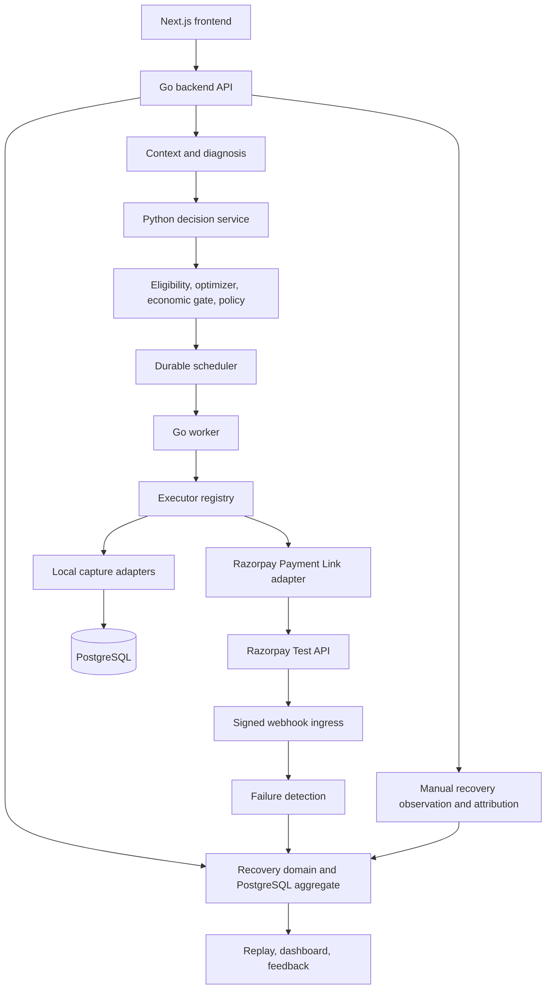

# Payment provider and recovery execution codebase guide

> Final-state update (2026-09-02): [FINAL_IMPLEMENTATION_AUDIT.md](FINAL_IMPLEMENTATION_AUDIT.md) is the canonical capability/gap classification and supersedes conflicting historical findings in this long-form guide.

This is the source-backed guide to the current repository. It describes what
the implementation does today, including limitations and mismatches. It does
not treat an interface, planned phase, or Razorpay product capability as an
implemented application capability.

## 1. Runtime architecture



| Box | Source and primary code | Input | Output / durable effect |
|---|---|---|---|
| Frontend | `frontend/src/app`, `frontend/src/lib/api.ts` | Browser navigation and operator review | Reads dashboard, queue, observability, resilience and replay APIs; review UI posts human decisions |
| Backend API | `backend/cmd/api/main.go` | HTTP JSON, raw Razorpay webhook bytes | Calls domain services; writes PostgreSQL; Redis is only health-checked |
| Recovery domain | `internal/recovery.Service`, `internal/domain` | Valid case creation, transitions, events | `recovery_cases`, immutable `recovery_events` |
| Context/diagnosis | `internal/context.Service.Get`, `Diagnose` | Case, customer/profile, merchant/policy, action history, promise | Observable-only `recovery-context-v1`; no table write |
| Decision service | `decision-service/prediction/*`, `internal/decisionclient.Client` | Context plus eligible action names | Outcome and natural-recovery probabilities |
| Decision pipeline | `internal/decisioning.Service.Decide` | Context and model responses | Predictions, ranked NERV candidates, gate and policy rows/events |
| Scheduler | `orchestrator.Scheduler`, `store.ScheduleDecision` | Approved, economically allowed snapshot | `recovery_actions`, `scheduled_actions`; case moves through `POLICY_REVIEW` to `SCHEDULED` |
| Worker | `cmd/worker/main.go`, `orchestrator.Worker.RunOnce` | Claimed due action and fresh context | Reauthorization, execution, retry/observation scheduling, action events/state |
| Executor registry | `executor.Registry` | `executor.Request` | Dispatches to first executor whose `Supports` returns true |
| Local adapters | `EmailExecutor`, `LocalPaymentLinkExecutor`, `RetryExecutor` with `store.Postgres` | Contact, link, or retry action | `email_deliveries` or `retry_requests`; no network provider call |
| Razorpay adapter | `integrations/razorpay.Client` and `PaymentLinkExecutor` | `SEND_PAYMENT_LINK` only | Razorpay Test Mode Payment Link, `provider_action_references`, `executions` |
| Webhook ingress | `api.Detection.razorpayWebhook`, `razorpay.Ingestor` | Raw body and Razorpay headers | `webhook_events`; supported failures can create a case |
| Recovery outcome | `attribution.Service.Observe`, `store.AttributeRecovery` | Explicit case ID, amount and payment reference | Marks case `RECOVERED`; attribution, promise, feedback and audit rows |
| Replay/reporting | `store.GetReplay`, `reporting.Service` | Case ID or dashboard request | Read-only combined operational history |

PostgreSQL is authoritative for workflow state. Redis is instantiated and
pinged by the backend readiness check, but the execution, webhook, idempotency,
and reconciliation paths in this guide do not read or write Redis.

## 2. Configuration and environment variables

Copy `.env.example` to `.env`. Do not commit `.env` or print secret values.

### Docker startup variables

| Variable | Required for normal Compose startup? | Consumer | Meaning |
|---|---:|---|---|
| `APP_ENV` | Yes/recommended | Backend, worker, decision service | Runtime label. The Resilience Lab is enabled only for `development`, `demo`, or `test`. |
| `FRONTEND_PORT` | Yes | Compose | Host port mapped to frontend port 3000. |
| `BACKEND_PORT` | Yes | Compose | Host port mapped to backend port 8080. |
| `DECISION_SERVICE_PORT` | Yes | Compose | Host port mapped to decision service port 8001. |
| `POSTGRES_DB` | Yes | Compose/PostgreSQL/migrations | Database name. |
| `POSTGRES_USER` | Yes | Compose/PostgreSQL/migrations | Database user. |
| `POSTGRES_PASSWORD` | Yes, secret outside local demo | Compose/PostgreSQL/migrations | Database password. |
| `POSTGRES_PORT` | Yes | Compose | Host PostgreSQL port. |
| `REDIS_PORT` | Yes | Compose | Host Redis port. |
| `NEXT_PUBLIC_BACKEND_URL` | Yes/recommended | Frontend | Browser-visible backend base URL, normally `http://localhost:8080`. |

### Backend/worker connection variables

| Variable | Compose behavior | Native-process behavior |
|---|---|---|
| `DATABASE_URL` | Compose builds its own URL using the PostgreSQL service and credentials | Required for a backend/worker run directly on the host |
| `REDIS_URL` | Compose uses `redis://redis:6379/0` | Required by native backend; currently readiness-only |
| `DECISION_SERVICE_URL` | Compose uses `http://decision-service:8001` | Required by native backend/worker |
| `FRONTEND_ORIGIN` | Backend defaults to `http://localhost:3000`; Compose currently does not propagate this variable | Controls the one allowed browser CORS origin |
| `WORKER_HEALTH_PORT` | Compose fixes it to 8082 | Worker health server port |
| `EVALUATION_RESULTS_PATH` | Compose uses `/evaluation/results` | Dashboard synthetic-results directory; backend default is `../decision-service/evaluation/results` |
| `BACKEND_INTERNAL_URL` | Compose-only frontend variable | Server-side frontend-to-backend URL |
| `OUTCOME_MODEL_PATH` | Optional, not set by Compose | Override Python outcome model artifact |
| `NATURAL_MODEL_PATH` | Optional, not set by Compose | Override Python natural-recovery model artifact |

### Razorpay variables

| Variable | Local mode | Razorpay mode / webhook role |
|---|---|---|
| `PAYMENT_PROVIDER` | Omit or set `local` | Set `razorpay` to select the real Payment Link executor in the worker |
| `RAZORPAY_KEY_ID` | Optional unless running the status/check CLI | Required by Razorpay worker; must have a Test Mode prefix |
| `RAZORPAY_KEY_SECRET` | Optional unless running the status/check CLI | Required by Razorpay worker; outbound Basic Auth only |
| `RAZORPAY_WEBHOOK_SECRET` | Required only to test/receive inbound Razorpay webhooks | Backend-only HMAC key; must equal Dashboard Test Mode webhook secret |
| `RAZORPAY_WEBHOOK_PUBLIC_URL` | Optional status marker | Non-secret marker that a public webhook URL was configured; not proof of delivery |
| `RAZORPAY_API_URL` | Optional default `https://api.razorpay.com` | Razorpay API base; client appends `/v1/...` safely |

The backend receives all Razorpay variables so it can ingest webhooks and expose
the safe status check. The worker receives API credentials, API URL, and provider
selection, but not the webhook secret. Frontend and decision service receive no
Razorpay secrets.

## 3. Provider selection

`config.Load` in `backend/internal/config/config.go` defaults
`PAYMENT_PROVIDER` to `local`. `cmd/worker/main.go` lowercases (but does not trim)
the value and constructs exactly one Payment Link executor:

- `local` -> `executor.NewLocalPaymentLinkExecutor(repository)`.
- `razorpay` -> a `razorpay.Client`, then
  `razorpay.NewPaymentLinkExecutor`, then `executor.NewPaymentLinkExecutor`.
- any other value -> logs `payment_provider_invalid` and exits the worker.

For `razorpay`, the worker requires both API credentials and `Mode() == "test"`.
Missing, unknown-prefix, or Live Mode credentials log
`razorpay_test_mode_configuration_invalid` and exit before work is processed.
The Razorpay client independently refuses `rzp_live_` credentials before making
HTTP requests. The safe status endpoint and CLI may authenticate while provider
selection remains `local`.

Compose supplies the same variable to backend and worker. They can disagree only
if started manually or overridden per container. The backend does not execute
actions; its provider value is informational in the status response. Therefore
an invalid value does not stop the backend, but it does stop the worker.

Provider selection changes **only `SEND_PAYMENT_LINK`**. Email-style actions and
retry capture use the same local PostgreSQL adapters in both modes.

## 4. Executor abstraction and action matrix

`executor.Executor` defines:

```go
Supports(domain.ActionType) bool
Execute(context.Context, executor.Request) (executor.Result, error)
Reconcile(context.Context, string) (executor.Result, error)
```

The registry checks executors in worker registration order: `EmailExecutor`,
selected Payment Link executor, then `RetryExecutor`. A missing implementation
returns `UNSUPPORTED_ACTION`. Execution has no public HTTP trigger: the worker
claims PostgreSQL work once per second.

| Action | Local behavior | Razorpay-provider behavior | External effect | Reconcile |
|---|---|---|---|---|
| `WAIT` | Scheduler intentionally creates no action | Same | None | N/A |
| `RETRY_NOW` | Immediately captures `retry_requests` row | Same local capture; no Razorpay retry API | No | Not supported |
| `RETRY_LATER` | Scheduled for +24h, then captures `retry_requests` | Same local capture | No | Not supported |
| `SEND_REMINDER` | `email_deliveries`, template `failed-payment-reminder` | Same | No real email | Not required/unsupported |
| `SEND_PAYMENT_LINK` | `email_deliveries`, template `local-payment-link`, `local.invalid` URL | Creates/fetches Razorpay Test Payment Link | Razorpay object only; no customer delivery | Supported only for persisted Razorpay link |
| `SEND_CHECKOUT_RECOVERY_LINK` | Email capture, template `checkout-recovery` | Same | No real email | Not required/unsupported |
| `REQUEST_PAYMENT_METHOD_UPDATE` | Email capture, template `payment-method-update` | Same | No real email | Not required/unsupported |
| `SUGGEST_ALTERNATE_METHOD` | Email capture, template `alternate-payment-method` | Same | No real email | Not required/unsupported |
| `WAIT_FOR_PROMISE_TO_PAY` | Can be scored/scheduled, but no executor supports it | Same | None; execution fails `UNSUPPORTED_ACTION` | Not supported |
| `RETENTION_ACTION` | Can be scored/scheduled, but no executor supports it | Same | None; execution fails `UNSUPPORTED_ACTION` | Not supported |
| `ESCALATE_TO_HUMAN` | Eligibility/control concept; not model-scored or executed | Same | Operations queue is driven by policy `ESCALATE` | N/A |
| `STOP` | Policy/operator terminal control; not model-scored or executed | Same | Case becomes `STOPPED` | N/A |

`WAIT_FOR_PROMISE_TO_PAY` and `RETENTION_ACTION` being scoreable without an
executor is an implementation gap, not intended control-only behavior.

## 5. Scheduling, idempotency, execution, and workflow retry

`decisioning.Service.Decide` obtains context, filters eligibility, calls both
Python predictors, ranks incremental value, applies the economic gate, evaluates
policy and persists the immutable decision snapshot. `Scheduler.Schedule` only
schedules `APPROVE` + `ALLOW` + non-`WAIT` results.

`store.ScheduleDecision` atomically creates:

- `recovery_actions` with `SCHEDULED` status;
- `scheduled_actions` with maximum three attempts and stable key
  `scheduled-action:<scheduled-id>`;
- valid case transitions `ACTION_PENDING -> POLICY_REVIEW -> SCHEDULED`;
- an `ACTION_SCHEDULED` audit event.

`RETRY_LATER` gets `scheduled_for = now + 24h`; other scheduled actions are due
immediately. Workers claim with `FOR UPDATE SKIP LOCKED`, a two-minute lease, and
increment `attempt_count`. Before executing, the worker blocks stale/recovered
work, reloads the gate, and reruns policy against current state.

`CompleteExecution` writes one `executions` row per
`<scheduled-idempotency-key>:<attempt>`. Retryable failures schedule exponential
delays of 1 then 2 minutes, up to three attempts. A successful or pending action
moves the case to `WAITING_OUTCOME` and schedules a 24-hour observation. No
recovery by then causes `REASSESSING -> ACTION_PENDING` and a fresh decision;
an expired recovery window produces `EXHAUSTED`.

## 6. Local provider mode

Local mode is deterministic at the side-effect boundary: a stable idempotency
key creates at most one capture row. IDs are random on the first clean run, but
the stored ID is reused on duplicate calls/restarts.

### Local email and link capture

`EmailExecutor` supports four email-style actions and whitelists payload fields:
amount, currency, and optional merchant name, recovery URL and deadline. Secrets
or arbitrary parameters are dropped. `CaptureEmail` inserts `email_deliveries`
with a unique idempotency key.

`LocalPaymentLinkExecutor` also uses `CaptureEmail`, with:

```text
template_name = local-payment-link
recipient_reference = internal customer ID
recovery_url = https://local.invalid/recovery/<scheduled-action-id>
provider = local-payment-link
```

There is no SMTP/email provider call and no HTTP Payment Link service.

### Local retry capture

Both retry actions call `store.Postgres.RequestRetry`, which inserts a unique
`retry_requests` row with status `CAPTURED`. The executor result is
`OUTCOME_PENDING` with provider `local-retry-capture`. It does not retry a card,
mandate, invoice, subscription, order, or Razorpay payment.

### Complete local `SEND_PAYMENT_LINK` flow

```text
RecoveryCase ACTION_PENDING
 -> decision/predictions/NERV/gate/policy
 -> recovery_action + scheduled_action
 -> worker claim and execution-time policy check
 -> LocalPaymentLinkExecutor
 -> email_deliveries(local-payment-link, local.invalid URL)
 -> executions(SUCCEEDED, provider reference = delivery ID)
 -> RecoveryCase WAITING_OUTCOME
 -> after 24h: reassessment, unless an observation marks RECOVERED
```

### Complete local `RETRY_LATER` flow

```text
RecoveryCase ACTION_PENDING
 -> NBA selects RETRY_LATER
 -> scheduled_for = now + 24h
 -> worker claims when due
 -> RetryExecutor -> retry_requests(CAPTURED)
 -> executions(OUTCOME_PENDING, provider=local-retry-capture)
 -> RecoveryCase WAITING_OUTCOME
 -> observation timeout/reassessment or explicit recovery observation
```

No local path writes Redis. The Resilience Lab uses in-memory injected executor
and repository doubles to model timeouts, crashes, duplicate delivery, stale
authorization and response loss; it records only the resulting
`resilience_evaluation_runs` row. It does not call the live local/Razorpay
adapter or mutate a real recovery case.

## 7. Razorpay Test Mode adapter

`razorpay.NewClient` strips trailing `/` and a trailing `/v1`. With the expected
base `https://api.razorpay.com`, implemented operations are:

| Operation | Function | HTTP request | Request fields | Response fields retained |
|---|---|---|---|---|
| Authentication check | `CheckAuthentication` | `GET /v1/payments?count=1` | Basic Auth | HTTP/reachability booleans only |
| Create Payment Link | `CreatePaymentLinkWithStatus` | `POST /v1/payment_links` | amount, currency, description, reference_id; optional customer/notify/callback supported by type | id, short_url, status, reference_id |
| Fetch Payment Link | `FetchPaymentLinkWithStatus` | `GET /v1/payment_links/{id}` | escaped Payment Link ID | id, short_url, status, reference_id |
| Fetch payment | `FetchPayment` | `GET /v1/payments/{id}` | escaped payment ID | id, status, amount, currency, order_id |

There is no automatic HTTP retry inside the client. The worker classifies
timeouts/network failures, HTTP 408/429 and 5xx as retryable; ordinary 4xx is
permanent. Provider response bodies are capped at 1 MiB, parsed only for a
provider error code, and never included in returned error text.

### Actual worker Payment Link request

`executor.PaymentLinkExecutor.Execute` supplies:

```text
amount       = RecoveryCase.amount_at_risk_minor
currency     = RecoveryCase.currency
description  = "Merchant-approved revenue recovery"
reference_id = scheduled_actions.id
customer     = omitted
notify       = omitted
callback_url = omitted
notes        = merchant_id, customer_id, recovery_case_id, recovery_action_id
```

The persisted provider reference is the Payment Link `id`. Its status and short
URL exist only inside the JSON `response` in `provider_action_references`; the
`executions.provider_reference` column also stores the Payment Link ID. There is
no delivery of the short URL to a customer in Razorpay mode.

## 8. Razorpay notes contract

`NormalizeWebhook` reads exactly these locations:

1. `payload.payment.entity.notes` when that map is non-empty;
2. otherwise `payload.subscription.entity.notes`.

Mandatory for every webhook that can reach detection:

```text
notes.merchant_id = an existing merchants.id
notes.customer_id = an existing customers.id owned by that merchant
```

For a subscription-only payload, because no payment amount/currency exists, the
same notes map must also contain:

```text
notes.amount_minor = positive JSON number
notes.currency = three-letter string such as INR
```

Failure detection reads `merchant_id`, `customer_id`, `amount_minor`, and
`currency`. A `payment_link.paid` outcome reads the Payment Link entity's
`recovery_case_id`, `merchant_id`, and `customer_id`. It resolves by the stored
Payment Link provider reference first, then its scheduled-action `reference_id`,
and uses the signed notes only as a validated fallback.

If the payment notes map contains any key but omits the mandatory mapping keys,
the code does **not** fall back to subscription notes. Missing mappings return
HTTP 422. Database foreign keys then require the mapped merchant/customer rows
to exist.

The outbound worker writes all four correlation notes and uses the durable
scheduled-action ID as Razorpay `reference_id`.

## 9. Actually supported Razorpay webhook events

`NormalizeWebhook` parses a generic envelope, but `detection.SubscriptionAdapter`
is the authoritative event allowlist.

| Razorpay event | Supported | Normalized result | Case behavior | Minimum provider entity data |
|---|---:|---|---|---|
| `payment.failed` | Yes | `FAILED_SUBSCRIPTION` | Creates or deduplicates by merchant + source | payment ID, amount, currency, payment notes; error_code optional |
| `subscription.pending` | Conditional | `FAILED_SUBSCRIPTION` | Creates/deduplicates | subscription ID and notes including mappings, amount, currency |
| `subscription.halted` | Conditional | `FAILED_SUBSCRIPTION` | Creates/deduplicates | same as pending |
| `mandate.failed` | Conditional | `FAILED_SUBSCRIPTION` | Creates/deduplicates | payment or subscription ID plus amount/currency and mappings |
| `payment.mandate.failed` | Yes when shaped as payment failure | `FAILED_SUBSCRIPTION` | Creates/deduplicates | payment ID, amount, currency and mappings |
| `subscription.charged` | No, explicitly rejected | None | No update | Rejected as not a new revenue risk |
| `payment.authorized` | No | Adapter rejects event | No update | N/A |
| `payment.captured` | No | Adapter rejects event | No update | N/A |
| `payment_link.paid` | Yes | Recovery outcome | Resolves the originating case, attributes the recovered amount, and transitions it to `RECOVERED` idempotently | Payment Link ID, paid amount, reference/notes correlation |

There is no wildcard support despite the generic envelope. For supported events,
source reference is subscription ID when present, otherwise payment ID. Failure
category derives from `payment.error_code`; missing/unknown codes become
`CUSTOMER_INTENT_OR_UNKNOWN`. Subscription `status` is parsed but not used.

For the currently verified Razorpay Test account, configure only events the
Dashboard actually offers and this application handles: `payment.failed` and
`payment_link.paid`. The code retains subscription/mandate normalization for
accounts/products that expose those events, but this account cannot configure or
exercise `subscription.pending`, `subscription.halted`, `mandate.failed`, or
`payment.mandate.failed`. Do not treat those as part of this account's E2E test.

## 10. Canonical minimal valid webhook payloads

Run `infra/demo_seed.sql` first. The `merchant_id` and `customer_id` below are
real fixture identifiers. Keep every payload byte unchanged between signing and
sending. Omitting `created_at` intentionally makes the backend use receipt time,
so the seven-day recovery deadline remains in the future.

### `payment.failed`

```json
{"event":"payment.failed","payload":{"payment":{"entity":{"id":"pay_local_failure_001","amount":129900,"currency":"INR","error_code":"insufficient_funds","notes":{"merchant_id":"demo-merchant-v1","customer_id":"demo-customer-v1"}}}}}
```

Required: event, payment ID, positive amount, three-letter currency, both notes.
Optional: order ID, error code, created timestamp, subscription entity.

### `subscription.pending`

```json
{"event":"subscription.pending","payload":{"subscription":{"entity":{"id":"sub_local_pending_001","status":"pending","notes":{"merchant_id":"demo-merchant-v1","customer_id":"demo-customer-v1","amount_minor":129900,"currency":"INR"}}}}}
```

### `subscription.halted`

```json
{"event":"subscription.halted","payload":{"subscription":{"entity":{"id":"sub_local_halted_001","status":"halted","notes":{"merchant_id":"demo-merchant-v1","customer_id":"demo-customer-v1","amount_minor":129900,"currency":"INR"}}}}}
```

### `mandate.failed`

```json
{"event":"mandate.failed","payload":{"subscription":{"entity":{"id":"sub_local_mandate_001","status":"pending","notes":{"merchant_id":"demo-merchant-v1","customer_id":"demo-customer-v1","amount_minor":129900,"currency":"INR"}}}}}
```

### `payment.mandate.failed`

```json
{"event":"payment.mandate.failed","payload":{"payment":{"entity":{"id":"pay_local_mandate_001","amount":129900,"currency":"INR","error_code":"mandate_failed","notes":{"merchant_id":"demo-merchant-v1","customer_id":"demo-customer-v1"}}}}}
```

For subscription-only examples, `status` is optional to this repository even
though it may be present in a genuine Razorpay payload. `amount_minor` and
`currency` in notes are mandatory to this implementation.

## 11. Exact Git Bash signed-webhook test

From the repository root:

```bash
set -a
source .env
set +a

printf '%s' '{"event":"payment.failed","payload":{"payment":{"entity":{"id":"pay_local_failure_001","amount":129900,"currency":"INR","error_code":"insufficient_funds","notes":{"merchant_id":"demo-merchant-v1","customer_id":"demo-customer-v1"}}}}}' > razorpay-event.json

PAYLOAD_FILE=razorpay-event.json
EVENT_ID="local-payment-failed-$(date +%s)-$RANDOM"
SIGNATURE="$(openssl dgst -sha256 -hmac "$RAZORPAY_WEBHOOK_SECRET" "$PAYLOAD_FILE" | sed 's/^.*= //')"

curl --fail-with-body --silent --show-error \
  -X POST http://localhost:8080/api/v1/webhooks/razorpay \
  -H "Content-Type: application/json" \
  -H "X-Razorpay-Event-Id: $EVENT_ID" \
  -H "X-Razorpay-Signature: $SIGNATURE" \
  --data-binary "@$PAYLOAD_FILE"
echo
```

Expected first response: HTTP 200, `duplicate:false`, `risk_detected:true`, and
`created:true` on a clean source reference. Re-run the same curl without changing
`EVENT_ID`: HTTP 200 with `duplicate:true`.

To send any other canonical payload, write its exact one-line JSON using the
same `printf`, then recompute both `EVENT_ID` and `SIGNATURE` before curl.

### Negative cases

Invalid signature (always use a new event ID):

```bash
curl --silent --show-error -o invalid-response.json -w '%{http_code}\n' \
  -X POST http://localhost:8080/api/v1/webhooks/razorpay \
  -H "Content-Type: application/json" \
  -H "X-Razorpay-Event-Id: invalid-signature-$(date +%s)-$RANDOM" \
  -H "X-Razorpay-Signature: 00" \
  --data-binary @razorpay-event.json
cat invalid-response.json
```

Expected outcomes:

| Test | HTTP/result | Persistence |
|---|---|---|
| Valid new supported failure | 200, duplicate false | `webhook_events=PROCESSED`, case created or source-deduplicated |
| Same valid event ID | 200, duplicate true | No second detection call |
| Invalid/modified signature | 401 `webhook_rejected` | No row; unauthenticated requests cannot reserve a genuine event ID |
| Missing event ID | 422 | No row |
| Malformed but correctly signed JSON | 422 | No row; normalization occurs before insert |
| Missing provider notes | 422 with mapping error | Verified row marked `FAILED` |
| Signed `payment.captured` with valid payment shape/notes | 422 unsupported event | Row inserted then marked `FAILED` |
| Signed `subscription.charged` | 422 success-is-not-risk error | Verified row marked `FAILED` |
| Correlated `payment_link.paid` | 200, outcome `RECOVERED` | Strong exact-reference attribution and recovered case |

Invalid signatures are deliberately not persisted, preventing event-ID poisoning.

## 12. Webhook call flow

```text
POST /api/v1/webhooks/razorpay
 -> api.Detection.razorpayWebhook reads raw bytes (2 MiB limit)
 -> Ingestor.Ingest requires X-Razorpay-Event-Id
 -> Verifier.Verify computes HMAC-SHA256(raw body, webhook secret)
 -> JSON envelope is parsed and provider references extracted
 -> InsertWebhook enforces UNIQUE(provider, provider_event_id)
 -> duplicate returns 200 without detection
 -> payment_link.paid resolves the stored provider reference and calls attribution
 -> otherwise detection.Service.Detect calls SubscriptionAdapter.Normalize
 -> NormalizedLeak.Validate
 -> recovery.Service.GetCaseBySource(merchant, source)
 -> existing case returned OR recovery.Service.CreateCase
 -> recovery_cases + REVENUE_RISK_DETECTED/CASE_CREATED events
 -> webhook row marked PROCESSED or FAILED
 -> HTTP 200 or 422
```

Invalid signatures are rejected without persistence. Malformed JSON is rejected
before insert. A valid JSON envelope is durably deduplicated before domain
processing; later mapping, validation, or database failures are marked `FAILED`.

## 13. Failure creation versus recovery observation

The failure allowlist is treated as **new revenue-risk failures**.
They create a `DETECTED` case or return the case already matching
`UNIQUE(merchant_id, source_reference)`. They do not update an existing case's
status or state beyond returning it.

`payment_link.paid` is the automatic success path. It uses the Payment Link ID
as the payment reference, so an execution's exact provider reference wins
attribution and the case becomes `RECOVERED`. Recovery can also be recorded
manually through:

```text
POST /api/v1/recovery-cases/{case-id}/recovery-observations
```

Example:

```json
{
  "recovered_amount_minor": 129900,
  "payment_reference": "a-provider-reference",
  "observed_at": "2026-09-02T12:00:00Z",
  "correlation_id": "manual-test-observation-1"
}
```

Attribution matching precedence is exact `executions.provider_reference`, active
promise window, recent retry, recent action, natural recovery, then unknown. It
marks the specified case `RECOVERED`, creates `recovery_attributions`, may fulfill
a promise, may create `feedback_records`, and appends transition/attribution/
completion events. Generic `payment.authorized` and `payment.captured` are not
used for automatic attribution to avoid ambiguous or duplicate recovery.

## 14. Provider-reference model and reconciliation

`provider_action_references` contains:

```text
id
action_id -> recovery_actions.id
provider
operation
provider_reference
response JSONB
created_at
UNIQUE(action_id, provider, operation)
```

There is no separate status/update timestamp; Payment Link status is a field in
the stored response JSON. The normal flow is:

```text
recovery_action
 -> GetPaymentLink(action ID or recovery-action idempotency key)
 -> absent: POST Razorpay link
 -> SavePaymentLink(action ID, link ID, response)
 -> execution stores link ID
 -> later/restart: stored response is reused
 -> worker attempt >1: GET stored link ID before a new create
```

Reconciliation classification:

| Path | Status | Detail |
|---|---|---|
| Razorpay Payment Link | Supported after reference persisted | Lookup by recovery action ID/idempotency key, then `GET /v1/payment_links/{id}`; any successful fetch is returned as executor success regardless of provider link status |
| Razorpay payment | Partial/read-only | `FetchPayment` exists but worker/reconciliation/webhook outcome code does not call it |
| Retry capture | Not supported | Stable `retry_requests` insert prevents duplicates; no provider state to fetch |
| Email capture | Not supported/needed | Stable `email_deliveries` insert prevents duplicates |
| Local Payment Link | Not supported/needed | Same transactional capture behavior |

If Razorpay creates a Payment Link but the response is lost before
`provider_action_references` is committed, real reconciliation cannot discover
it: the code does not search Razorpay by `reference_id`. A later create may fail
on duplicate reference. The Resilience Lab's abstract executor demonstrates the
desired success-response-lost invariant, but this exact real-provider gap remains.

## 15. Three different meanings of retry

1. **Workflow retry:** implemented. Retryable executor failures cause the same
   scheduled action to be claimed again, up to three attempts with backoff.
2. **Provider HTTP retry:** not implemented inside `razorpay.Client`; every
   method makes one HTTP request. Worker workflow retry surrounds it.
3. **Payment retry action:** no real payment retry provider. `RETRY_NOW` and
   `RETRY_LATER` always write `retry_requests`, even when
   `PAYMENT_PROVIDER=razorpay`.

`RETRY_NOW` is scheduled immediately. `RETRY_LATER` is delayed by 24 hours.
Both produce `OUTCOME_PENDING`, then the normal observation timeout applies.

## 16. Payment Link end-to-end reality

| Stage | Status |
|---|---|
| Case/context/NBA/gate/policy/scheduling | Implemented |
| Human escalation and reauthorized approval | Implemented |
| Worker creates Test Mode Payment Link | Implemented when provider is `razorpay` |
| Persist/reuse/fetch provider reference | Implemented with limitations above |
| Deliver short URL to customer | Not implemented |
| Attach internal mapping notes | Implemented on worker-created links |
| Configure public Dashboard webhook | Needs Dashboard/public URL configuration |
| Receive failure webhooks | Implemented for allowlisted failure events |
| Receive `payment_link.paid` as recovery | Implemented |
| Automatically map Payment Link success to case and attribution | Implemented |
| Manual recovery observation/attribution/replay | Implemented |

The code supports the Test Mode Payment Link-to-recovered-case loop. Short-URL
delivery and an interstitial-free public Dashboard endpoint remain external
requirements.

## 17. Subscription support

| Capability | Classification | Detail |
|---|---|---|
| Subscription failure webhook normalization | Partial | `subscription.pending` and `subscription.halted`, plus mandate events, accepted only with internal mapping and amount/currency notes |
| Failure detection/case creation | Implemented conditionally | Creates `FAILED_SUBSCRIPTION` when IDs, money, fixture rows and deadline are valid |
| Source reference | Implemented | Subscription ID preferred; payment ID fallback |
| Recovery action selection | Implemented | Eligibility permits subscription-compatible retries/update/PTP plus common actions |
| Subscription status lookup | Not implemented | No `/v1/subscriptions/{id}` client method |
| Subscription reconciliation | Not implemented | No worker path |
| Subscription success recovery | Not implemented | `subscription.charged` explicitly rejected and not routed to observation |

A genuine Test Mode subscription failure can create a case only if its actual
payload includes the repository-specific notes contract. The repository does
not contain code that provisions subscriptions with those notes.

## 18. Checkout abandonment support

Checkout events enter through `POST /api/v1/detection/checkout`, not through the
Razorpay normalizer or current frontend. `CHECKOUT_STARTED` and
`CHECKOUT_PAYMENT_SELECTED` update `checkout_sessions` and return 202/no risk.
`CHECKOUT_PAYMENT_FAILED` and `CHECKOUT_ABANDONED` create a
`CHECKOUT_ABANDONMENT` case if the session exists and is not expired.

Minimal two-call local sequence:

```bash
NOW="$(date -u +%Y-%m-%dT%H:%M:%SZ)"
VALID_UNTIL="2035-01-01T00:00:00Z"

curl --fail-with-body --silent -X POST http://localhost:8080/api/v1/detection/checkout \
  -H 'Content-Type: application/json' -H "X-Event-Id: checkout-start-$RANDOM" \
  --data-binary "{\"event_type\":\"CHECKOUT_STARTED\",\"checkout_id\":\"checkout-local-001\",\"merchant_id\":\"demo-merchant-v1\",\"customer_id\":\"demo-customer-v1\",\"amount_minor\":89900,\"currency\":\"INR\",\"checkout_stage\":\"PAYMENT\",\"occurred_at\":\"$NOW\",\"valid_until\":\"$VALID_UNTIL\"}"
echo

curl --fail-with-body --silent -X POST http://localhost:8080/api/v1/detection/checkout \
  -H 'Content-Type: application/json' -H "X-Event-Id: checkout-abandon-$RANDOM" \
  --data-binary "{\"event_type\":\"CHECKOUT_ABANDONED\",\"checkout_id\":\"checkout-local-001\",\"checkout_stage\":\"PAYMENT\",\"abandonment_reason\":\"payment_friction\",\"occurred_at\":\"$NOW\"}"
echo
```

The simulator independently generates synthetic checkout scenarios; those rows
do not automatically enter the operational database.

## 19. Important database tables

| Table | Writer/purpose |
|---|---|
| `merchants`, `merchant_policies` | Identity and authorization/economic constraints |
| `customers`, `customer_recovery_profiles` | Observable customer context and safe contact reference |
| `recovery_cases` | Stateful aggregate, source deduplication and money at risk |
| `recovery_events` | Append-only ordered audit history |
| `checkout_sessions` | Internal checkout state before abandonment detection |
| `webhook_events` | Raw provider payload, signature/processing status, provider IDs, dedupe |
| `action_predictions`, `natural_recovery_predictions` | Model output traces |
| `recovery_decisions`, `recovery_decision_candidates` | Selected NBA and ranked alternatives |
| `economic_gate_evaluations`, `policy_evaluations` | Economic and deterministic authorization evidence |
| `recovery_actions`, `scheduled_actions` | Intended action and leased durable work |
| `executions` | Per-attempt result/provider reference |
| `email_deliveries` | Development-only contact/Payment Link capture |
| `retry_requests` | Development-only payment-retry intent capture |
| `provider_action_references` | Razorpay action/object mapping and create response |
| `promises_to_pay`, `promise_events`, `promise_checks` | Promise lifecycle and due checks |
| `human_review_records` | Immutable operator decisions and reauthorization |
| `recovery_attributions` | Evidence-based recovery credit |
| `feedback_records` | Observable training feedback linked to attribution |
| `resilience_evaluation_runs` | Persisted fault-lab summaries |

Replay includes most case-centric decision/action/outcome tables, but currently
does not include `provider_action_references`, `email_deliveries`,
`retry_requests`, `webhook_events`, or `feedback_records`.

## 20. Demo fixtures

`infra/demo_seed.sql` is idempotent and contains no real contact data:

| Entity | Identifier / purpose |
|---|---|
| Merchant | `demo-merchant-v1` |
| Policy | `demo-policy-v1` |
| Customer | `demo-customer-v1` |
| Recovery profile | `demo-profile-v1` |
| Recovered case | `demo-recovered-case-v1` |
| Active promise case | `demo-ptp-case-v1` |
| Escalated/human-review case | `demo-escalated-case-v1` |
| Active promise | `demo-promise-v1` |
| Seed decision | `demo-decision-escalated-v1` |
| Razorpay CLI FK fixture action | `demo-razorpay-check-action-v1` |

Use `demo-merchant-v1` and `demo-customer-v1` in canonical webhook notes.
Webhook payment/subscription IDs must be unique if a new case is desired.
`scripts/demo-bootstrap.sh` and `.ps1` start Compose, seed PostgreSQL, wait for
backend/frontend health, and print dashboard/replay URLs.

## 21. Relevant API inventory

All routes below are currently unauthenticated application routes unless noted.
CORS is not authentication and does not block curl or server-to-server calls.

| Method/path | Input | Output/purpose | Security |
|---|---|---|---|
| `GET /health/live`, `/health/ready` | None | Process/dependency/schema health | None |
| `GET /metrics` | None | Go Prometheus text | None |
| `GET /api/v1/integrations/razorpay/status` | None | Safe auth/mode/capability booleans | No secrets returned; otherwise unauthenticated |
| `POST /api/v1/webhooks/razorpay` | Raw JSON + Razorpay event/signature headers | Verify, dedupe, normalize supported failure | HMAC-SHA256 only |
| `POST /api/v1/detection/subscription` | Normalized subscription JSON + `X-Event-Id` | Create/dedup failed-subscription case | None |
| `POST /api/v1/detection/checkout` | Checkout event + `X-Event-Id` | Update checkout session/create abandonment case | None |
| `POST /api/v1/recovery-cases` | `CreateCaseInput` JSON | New DETECTED case and base events | None |
| `GET /api/v1/recovery-cases/:id` | Case ID | Aggregate | None |
| `POST /api/v1/recovery-cases/:id/transitions` | target state, expected version, actor/payload | Optimistic state transition + event | None |
| `GET/POST /api/v1/recovery-cases/:id/events` | ID / manual event input | Read or append permitted event | None |
| `GET /api/v1/recovery-cases/:id/context` | ID | Observable decision context | None |
| `GET /api/v1/recovery-cases/:id/eligibility` | ID | Eligible/excluded action reasons | None |
| `POST /api/v1/recovery-cases/:id/predictions` | ID | Older prediction trace endpoint | None |
| `POST /api/v1/recovery-cases/:id/decision` | ID | Decide and optionally schedule | None |
| `GET /api/v1/recovery-cases/:id/workflow` | ID | Latest decision/policy, schedules, executions | None |
| `POST /api/v1/recovery-cases/:id/recovery-observations` | amount, payment reference, time/correlation | Recover and attribute case | None |
| `GET /api/v1/recovery-cases/:id/attributions` | ID | Attribution history | None |
| `GET /api/v1/recovery-cases/:id/replay` | ID | Full replay view | None |
| `GET /api/v1/operations/recovery-queue[/metrics|/:id]` | Optional filters / ID | Human review data | None |
| `POST /api/v1/operations/recovery-queue/:id/review` | operator decision/version/idempotency | Reauthorize and schedule/reject/defer/stop | No identity authentication; actor fields are caller supplied |
| `GET /api/v1/observability` | None | Durable queue/execution/recovery snapshot | None |
| `GET /api/v1/dashboard` | None | Operational + synthetic summary | None |
| `POST /api/v1/resilience/scenarios/:scenario/run` | Scenario path | Persisted fault simulation | Environment guard only |
| `GET /api/v1/resilience/runs/:id` | Run ID | Fault result | Environment guard only |

The Python service additionally exposes `/api/v1/predict/outcomes`,
`/api/v1/predict/natural`, health endpoints, and metrics. It also has no auth and
is published on the configured host port in Compose.

## 22. Expected provider-mode matrix

| Operation | `local` | `razorpay` |
|---|---|---|
| `SEND_PAYMENT_LINK` | One idempotent `email_deliveries` capture; execution provider `local-payment-link`; no network | Test API create/reuse; `provider_action_references` + execution; provider object exists but link is not delivered |
| `RETRY_NOW` | Immediate `retry_requests` capture | Identical local capture; no Razorpay call |
| `RETRY_LATER` | +24h schedule then retry capture | Identical local capture |
| Email-style actions | Local `email_deliveries` | Still local `email_deliveries` |
| Webhook ingestion | Available if webhook secret set; independent of provider selection | Identical inbound behavior |
| Reconciliation | Transactional local dedupe; explicit reconcile returns error | Payment Link fetch only after reference persistence |
| Logs/replay | Action scheduled/executed and local provider name in execution | Razorpay provider name/link ID in execution; link response itself absent from replay |

## 23. Testing the application

### A. Full CLI startup and regression suite

```bash
cd /c/Users/akash/PROJECTS/Razorpay/revenue-recovery
test -f .env || cp .env.example .env
docker compose config --quiet
docker compose up -d --build
docker compose exec -T postgres sh -c 'psql -v ON_ERROR_STOP=1 -U "$POSTGRES_USER" -d "$POSTGRES_DB"' < infra/demo_seed.sql
docker compose ps

curl --fail --silent http://localhost:8080/health/ready; echo
curl --fail --silent http://localhost:8001/health/ready; echo
curl --fail --silent http://localhost:3000/api/health; echo
curl --fail --silent http://localhost:8080/api/v1/observability; echo

powershell.exe -ExecutionPolicy Bypass -File ./scripts/verify.ps1
cat evaluation/results/phase33/verification_summary.json
```

Inspect durable state without exposing credentials:

```bash
docker compose exec -T postgres sh -c 'psql -U "$POSTGRES_USER" -d "$POSTGRES_DB" -c "SELECT id,current_state,source_reference FROM recovery_cases ORDER BY created_at DESC;"'
docker compose exec -T postgres sh -c 'psql -U "$POSTGRES_USER" -d "$POSTGRES_DB" -c "SELECT action,status,attempt_count,failure_reason FROM scheduled_actions ORDER BY created_at DESC;"'
docker compose exec -T postgres sh -c 'psql -U "$POSTGRES_USER" -d "$POSTGRES_DB" -c "SELECT status,provider_reference,failure_class,retryable FROM executions ORDER BY started_at DESC;"'
```

### B. Local-provider functional test

Set `PAYMENT_PROVIDER=local`, recreate backend/worker, then use the seeded
Operations case. Read its current version rather than assuming it:

```bash
docker compose up -d --force-recreate backend worker
curl --fail --silent http://localhost:8080/api/v1/operations/recovery-queue/demo-escalated-case-v1; echo
```

Approve through the frontend Operations page, or post the review using the
`case_version` returned above:

```bash
curl --fail-with-body --silent -X POST \
  http://localhost:8080/api/v1/operations/recovery-queue/demo-escalated-case-v1/review \
  -H 'Content-Type: application/json' \
  --data-binary '{"decision":"APPROVE","operator_id":"local-test-operator","actor_type":"SYSTEM_TEST","reason_code":"LOCAL_PROVIDER_TEST","notes":"synthetic fixture","expected_case_version":4,"idempotency_key":"local-provider-approval-001"}'
echo

sleep 3
curl --fail --silent http://localhost:8080/api/v1/recovery-cases/demo-escalated-case-v1/replay; echo
```

On a clean seed the expected version is 4, but always use the returned version.
The seed is idempotent, not a state reset; after approval, use a fresh database
or a new fixture to repeat this exact test.

### C. Razorpay Test Mode checks

Set `PAYMENT_PROVIDER=razorpay`, use Test keys only, then:

```bash
docker compose up -d --build --force-recreate backend worker
docker compose exec -T backend ./razorpay-check
docker compose exec -T backend ./razorpay-check --create-payment-link
curl --fail --silent http://localhost:8080/api/v1/integrations/razorpay/status; echo
```

The second CLI command uses a stable ₹1 fixture and reuses the provider reference.
It tests create/persist/fetch without requiring the NBA workflow. To test worker
creation, reset/use a fresh escalated fixture and perform the same human approval
as above. This creates a Test Payment Link with durable correlation metadata.
A genuine `payment_link.paid` delivery then attributes the link and marks the
originating case recovered; customer delivery of the short URL remains outside
this implementation.

### D. Frontend test tour

| URL | What to verify |
|---|---|
| `http://localhost:3000/` | Operational risk/recovery metrics, active cases, synthetic evaluation |
| `/operations` | Seeded escalated case, evidence, approve/reject/defer/stop and immutable review |
| `/observability` | Queue lag, execution outcomes, recovery counts, schema and alerts |
| `/resilience` | Run duplicate webhook, timeout, crash, stale decision and response-loss simulations |
| `/recovery/demo-recovered-case-v1` | Full seeded replay and provenance |
| `/recovery/<new-case-id>` | Inspect decisions, policy, execution and manual attribution for a tested case |

There is no frontend page for Razorpay status, webhook payload submission,
checkout ingestion, or exposing a created Payment Link URL. The navigation label
currently always says `RAZORPAY TEST MODE`, even when provider selection is local.

## 24. Safe scope and unsupported behavior

### Safe deterministic/offline tests

- Full Go/Python/frontend regression suite.
- Simulator generation/evaluation.
- Local webhook HMAC with synthetic payloads.
- Internal subscription/checkout detection.
- Local email/link/retry capture.
- Operations, replay, observability and Resilience Lab.
- Manual recovery observation and attribution using synthetic references.

### Safe Razorpay Test Mode tests

- Authentication status GET.
- One stable synthetic ₹1 Payment Link create/reuse/fetch.
- Worker Payment Link creation using synthetic seeded data.
- Real signed Test Mode failure webhook after public Dashboard setup.
- Correlated `payment_link.paid` recovery and exact-reference attribution.

### Not supported / do not claim

- Live Mode (explicitly blocked).
- Real email/SMS/customer link delivery.
- Direct Razorpay retry for `RETRY_NOW` or `RETRY_LATER`.
- Subscription fetch or reconciliation.
- Automatic success observation from generic payment/order/invoice events.
- Provider search by reference after response loss.
- Authenticated operator/admin API access.

## 25. Priority gaps and architectural surprises

1. **Narrow success-webhook path:** `payment_link.paid` is handled, while generic
   `payment.captured`, `payment.authorized`, and invoice/order success events are
   intentionally not attributed automatically.
2. **Payment Link is not delivered:** customer/notify are omitted and no local
   email is generated in Razorpay mode.
3. **Real response-loss gap:** reconciliation needs a locally persisted provider
   ID and cannot find a created link by its stable reference ID.
4. **Provider selector scope:** only Payment Links change; retries/emails remain
   local in Razorpay mode.
5. **Unsupported scoreable actions:** PTP-wait and retention can be selected and
   scheduled but fail at the executor registry.
6. **Payment Link status semantics:** any successful fetch is treated as
   execution success; `cancelled`/`expired` is not interpreted.
7. **No API authentication:** all operational and review endpoints trust the
    caller; actor identity is request data.
8. **Frontend mode label:** always displays Razorpay Test Mode and does not read
    actual `PAYMENT_PROVIDER`.
9. **Configuration mismatch:** changing `FRONTEND_PORT` does not propagate a
    matching `FRONTEND_ORIGIN` into the backend Compose service.
10. **Free zrok interstitial:** the tested `shares.zrok.io` endpoint intercepts
    requests unless `skip_zrok_interstitial` is present. Razorpay Dashboard
    cannot be assumed to add that header; use an interstitial-free share/domain
    before relying on real provider delivery.

These gaps do not invalidate deterministic local evaluation or the verified
Test Mode create/fetch adapter, but they prevent claiming a complete automatic
Razorpay revenue-recovery loop.
