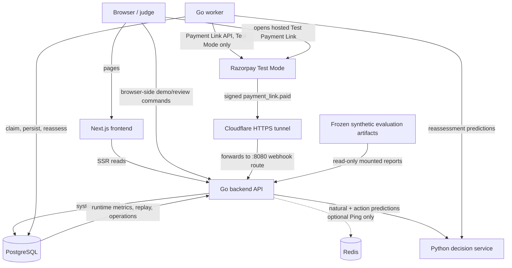
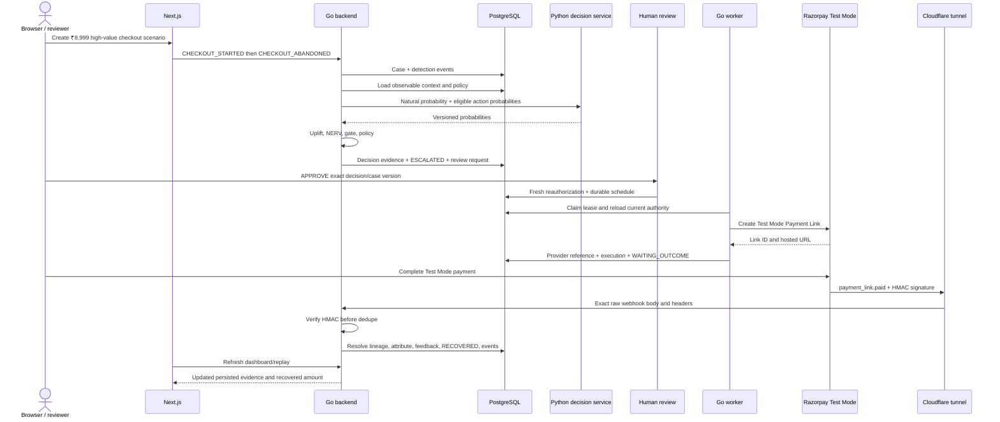
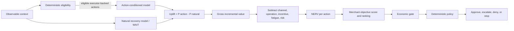
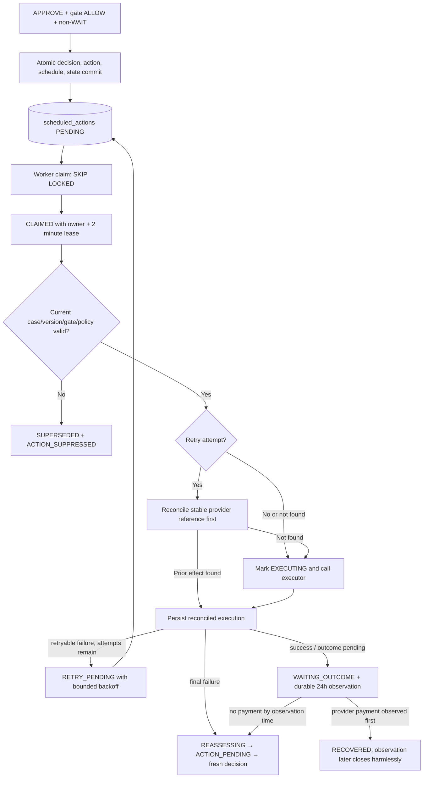
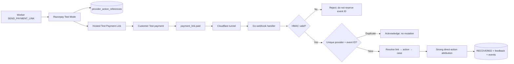
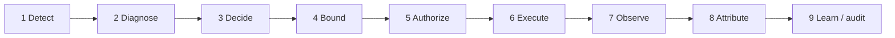

# RecoverOS Technical Architecture Report

**Repository source-of-truth review:** 2026-09-02  
**Current database schema marker:** `phase_55`  
**Scope:** current implementation, including deterministic local/demo operation, Razorpay Test Mode, and frozen synthetic evaluation

This report explains the system that exists in the repository. It does not treat earlier phase plans as proof of implementation, and it does not describe Razorpay Live Mode or synthetic results as production recovery evidence.

## 1. System overview

RecoverOS is a stateful revenue-recovery decision and execution system. It receives evidence that revenue is at risk—for example, a failed subscription payment or an abandoned checkout—creates an authoritative `RecoveryCase`, diagnoses the likely failure class, estimates the value of possible responses, applies deterministic safety and merchant controls, executes approved work asynchronously, and attributes an observed payment only when there is sufficient evidence connecting it to the recovery workflow.

The high-level lifecycle is:

> Revenue risk detected → diagnosis → decision → safety/economic controls → human review if required → durable execution → provider outcome → attribution → feedback/audit

RecoverOS is more than a retry engine because retrying is only one candidate behavior. It can decide to wait, send a reminder or Payment Link, request a payment-method update, suggest an alternate method, suppress contact during a Promise-to-Pay (PTP), stop, or escalate. It compares an intervention with the estimated natural-recovery baseline, includes cost/fatigue/risk in the economic calculation, respects merchant and customer constraints, and separates “a payment happened” from “RecoverOS caused or assisted the recovery.”

The governing principle is:

> **AI estimates what is likely to work. Deterministic systems decide what is allowed to happen.**

In the current implementation, “AI” means versioned statistical probability models served by Python; there is no generative model or LLM in the authorization path.

### Runtime modes and evidence scopes

| Scope or mode | What it actually means | What it does not prove |
|---|---|---|
| Local/demo provider | PostgreSQL-backed cases, decisions, schedules, worker execution, captured email/retry requests, and a non-payable `local.invalid` Payment Link | External delivery, provider acceptance, or payment |
| Razorpay Test Mode | Real Razorpay Test Mode Payment Link API calls and genuine signed webhook handling; the worker refuses Razorpay live keys | Real-money recovery or Live Mode readiness |
| Operational/runtime views | Data read from the current PostgreSQL database | Production data: the same database can contain local demo and Razorpay Test Mode cases |
| Synthetic held-out evaluation | Reproducible simulated customers, potential outcomes, strategies, and frozen multi-seed reports | Production causal lift or merchant revenue |

`APP_ENV` also gates development-only scenario and resilience endpoints. It is separate from `PAYMENT_PROVIDER`, which chooses the Payment Link executor.

## 2. High-level architecture



| Component | Why it exists / responsibility | Data it owns | Direct communication |
|---|---|---|---|
| Next.js frontend | Judge/operator UI, guided actions, explanation and visualization | Browser/UI state only | Browser, Go API |
| Go backend | Domain/API trust boundary and workflow coordinator | No private store; writes authoritative records to PostgreSQL | Frontend, PostgreSQL, decision service, Redis Ping, Razorpay status API, inbound webhooks |
| Python decision service | Isolates versioned statistical inference and feature validation | Packaged model artifacts plus process-local metrics | Go backend; worker during reassessment |
| PostgreSQL | Surviving source of truth and coordination boundary | All durable operational domain/evidence records | Go backend and worker |
| Redis | Currently an optional runtime availability signal | No RecoverOS application data | Backend readiness Ping only |
| Go worker | Asynchronous scheduler/executor, PTP checker, and reassessment driver | No separate store; claims and updates PostgreSQL rows | PostgreSQL, decision service, Razorpay Test Mode |
| Razorpay Test Mode | External hosted Payment Link and sandbox payment system | Razorpay Test objects and delivery history | Worker outbound API, customer browser, Cloudflare webhook URL |
| Cloudflare tunnel | Temporary public HTTPS ingress for Razorpay callbacks | No RecoverOS business data; transient forwarding only | Razorpay to backend webhook route |

### Next.js frontend

The frontend is the operator and demonstration surface. Server-rendered pages read the backend through `BACKEND_INTERNAL_URL`; browser-side scenario, review, PTP, and resilience controls use `NEXT_PUBLIC_BACKEND_URL`. It owns presentation state only. Authoritative cases, approvals, execution state, metrics, and evidence always come back from the Go API/PostgreSQL.

The most important views are the operational dashboard, recovery list, case replay, Operations review queue, Observability, Evaluation, Resilience Lab, and guided Demo. The case page exposes the decision context, eligibility exclusions, candidate probabilities/NERV, gate, policy, review, execution, provider reference, webhook, attribution, feedback, and event history.

### Go backend

The Gin API is the domain coordinator and public trust boundary. It normalizes risk signals, creates and transitions cases, assembles observable decision context, calls the decision service, performs eligibility/optimization/gate/policy orchestration, accepts human decisions, verifies Razorpay webhooks, performs attribution, and serves replay/reporting/observability APIs.

It talks synchronously to PostgreSQL and the Python decision service. It creates a Redis client only for readiness probing. It also creates a Razorpay client for the non-mutating integration-status endpoint and owns the webhook secret; it does not create workflow Payment Links itself.

### Python decision service

The FastAPI service loads the versioned `outcome_v1.joblib` and `natural_recovery_v1.joblib` scikit-learn artifacts. It validates the observable feature contract and returns probabilities. It has no merchant-policy authority, writes no operational recovery state, and does not call Razorpay. Its metrics are process-local counters/timings; durable decisions are persisted by Go.

### PostgreSQL

PostgreSQL owns business truth: cases, versions, decision evidence, controls, schedules, leases, attempts, provider references, webhooks, attribution, feedback, reviews, PTP, and immutable event history. Both API and worker coordinate through it.

### Redis

Redis is provisioned and pinged by backend readiness. No recovery data, queue item, lock, cache, idempotency key, session, or rate limit is currently stored in Redis. It is non-authoritative.

### Worker

The separate Go worker polls PostgreSQL, claims due work with leases, reauthorizes it against current state, runs a registered executor, persists the result, schedules retries/outcome checks, checks due promises, and starts reassessment when needed. It owns external workflow side effects; the frontend/API request that selected an action does not.

### Razorpay Test Mode and Cloudflare

When `PAYMENT_PROVIDER=razorpay`, only `SEND_PAYMENT_LINK` uses Razorpay, and the worker refuses to start unless credentials are configured and the key is Test Mode. Cloudflare is not an application service in Compose; a separately running tunnel forwards the temporary public HTTPS webhook URL to the backend on port 8080. The URL marker in configuration is not itself proof that the tunnel or Razorpay Dashboard configuration is live.

## 3. Complete end-to-end recovery flow

The current guided high-value scenario creates a ₹8,999 (`899900` minor units) checkout abandonment for `demo-merchant-v1`. The seeded merchant policy allows `WAIT`, `RETRY_LATER`, `SEND_PAYMENT_LINK`, and `SEND_REMINDER`, and its ₹5,000 high-value threshold makes this case reviewable. The UI expects `SEND_PAYMENT_LINK` to win for the seeded payment-friction context, but that action is a model/optimizer result—not a hard-coded branch—so the persisted candidate ranking remains the source of truth.



The concrete responsibilities are:

1. **Checkout abandonment detected — frontend/API.** The demo endpoint submits `CHECKOUT_STARTED`, which persists checkout state, followed by `CHECKOUT_ABANDONED` with `payment_friction`.
2. **RecoveryCase created — detection/recovery service + PostgreSQL.** The checkout adapter normalizes the signal and creates a `CHECKOUT_ABANDONMENT` case, deduplicated by merchant and source reference.
3. **Cause diagnosed — Go context service.** The normalized failure/leak category is deterministically mapped to recoverability and confidence.
4. **Observable context created — Go context service.** Case data, payment history/profile, merchant policy/objective, action/contact history, PTP, timing, and payment state are assembled. Simulator-only hidden fields are rejected.
5. **Eligible actions determined — Go eligibility service.** Compatibility, action/channel availability, PTP, opt-out, caps, cooldown, quiet hours, deadline, mandate/payment method, and terminal conditions produce eligible and excluded sets with reasons.
6. **Decision service called — Go decisioning client.** Only eligible actions backed by a worker executor are sent for action-conditioned scoring; the natural model is called separately.
7. **Natural recovery estimated — Python natural model.** It scores the context using `WAIT` as the no-intervention reference.
8. **Action recovery estimated — Python outcome model.** It returns `P(recovery | action)` and artifact/feature versions for each submitted action.
9. **Incremental uplift calculated — Go optimizer.** Each action probability is reduced by the natural probability.
10. **NERV calculated — Go optimizer.** Expected incremental value is reduced by channel, operational, incentive, fatigue, and risk terms.
11. **Best action selected — Go optimizer.** Candidates are ordered first by merchant objective score, then NERV, with a stable action-name tie-break.
12. **Economic gate checked — Go economic gate.** Negative or below-threshold intervention value is blocked; `WAIT` is allowed as a no-intervention result.
13. **Policy decided — Go policy.** Deterministic precedence is `STOP`, then `DENY`, then `ESCALATE`, otherwise `APPROVE`.
14. **High value sent to review — policy + PostgreSQL.** ₹8,999 exceeds the seeded ₹5,000 threshold, so the decision and case become `ESCALATED`, with a review-request event.
15. **Human approves — Operations API/UI.** The review includes an operator, reason, idempotency key, and expected case version.
16. **Fresh reauthorization — Operations service + PostgreSQL.** Current state/version, current merchant-policy version, deadline, stored economic result, and freshly evaluated policy are checked transactionally.
17. **Action durably scheduled — PostgreSQL.** Approval, refreshed policy evidence, action, state transitions, and `scheduled_actions` row commit together.
18. **Worker claims action — worker + PostgreSQL.** `FOR UPDATE SKIP LOCKED` and a two-minute lease coordinate workers and recover expired claims.
19. **Razorpay Test Payment Link created — worker.** The `SEND_PAYMENT_LINK` executor calls Razorpay with the amount, currency, stable schedule reference, and correlation notes.
20. **Provider result stored — worker + PostgreSQL.** The link response is stored in `provider_action_references`; execution evidence is stored and the case waits for outcome.
21. **Customer pays — browser + Razorpay.** This is an external Test Mode user action. Link creation alone is not recovery.
22. **Webhook delivered — Razorpay + Cloudflare.** Razorpay sends `payment_link.paid` to the configured public tunnel, which forwards it to `/api/v1/webhooks/razorpay`.
23. **Signature verified — Go webhook ingestor.** HMAC-SHA256 is computed over the exact raw body using the webhook secret and constant-time compared before reserving the event ID.
24. **Payment resolved to case — Go/PostgreSQL.** Resolution prefers the stored Payment Link mapping, then stable schedule `reference_id`, then validated signed note IDs.
25. **Revenue attributed and case recovered — attribution service.** Exact link/execution evidence produces strong direct-action attribution, increments recovered amount, and moves the case to `RECOVERED` atomically.
26. **Feedback and audit stored — PostgreSQL.** Attribution-linked observable feedback and recovery events are written in the same transaction.
27. **Metrics update — reporting/observability APIs + frontend.** Dashboard values are recomputed from persisted cases/attributions; no frontend counter is authoritative.

## 4. Decision engine

### Observable inputs

The Python feature pipeline uses categorical inputs for leak type, failure type, payment method, previous action, customer segment, merchant type, checkout stage, and candidate action. Numeric inputs include amount, subscription tenure, prior failures/successes and success ratio, retry/contact counts, hours since failure, fatigue, and promise reliability.

The simulator also creates hidden characteristics—liquidity pattern, action responsiveness, contact sensitivity, natural-recovery propensity, method preference, churn intent, and related ground truth—but the inference contract recursively rejects those fields. The production-style decision path therefore sees only the observable projection.

### Natural and action-conditioned models

For context `x` and action `a`:

```text
p_natural = P(recovery | x, WAIT)
p_action  = P(recovery | x, action = a)
uplift(a) = p_action - p_natural
```

The natural model is a distinct versioned artifact. The action-conditioned model receives the same observable context plus each eligible executable action. Eligibility happens before prediction, so the model is not asked to recommend prohibited work.

### Eligible versus excluded actions

The domain vocabulary includes 12 actions. The operational optimizer currently scores seven worker-backed interventions (`RETRY_NOW`, `RETRY_LATER`, reminder, Payment Link, checkout recovery link, payment-method update, and alternate-method suggestion) plus the optimizer-added `WAIT` baseline. `WAIT_FOR_PROMISE_TO_PAY`, retention, human escalation, and stop are currently control semantics, not schedulable executors; eligibility can explain them, but they do not enter executable model ranking.

### NERV and ranking

The implemented amount calculation is integer-safe and operates in currency minor units:

```text
gross_incremental_value(a) = amount_at_risk × uplift(a)

NERV(a) = gross_incremental_value(a)
          - channel_cost(a)
          - operational_cost(a)
          - incentive_cost(a)
          - fatigue_penalty(a, customer)
          - risk_penalty(a, diagnosis_confidence)
```

The default cost model is `cost-v1`; the optimizer is `nba-v2-profiled`. Contact actions receive a fatigue penalty based on customer fatigue. Low diagnosis confidence creates a risk penalty; `WAIT` has no risk penalty. A configured merchant optimization profile applies explicit basis-point weights to revenue, retention, contact, cost, fatigue, and risk. Without a profile, the merchant objective adjusts the score for net recovery, retention, contact minimization, cost minimization, or a balanced objective.

The next-best action is therefore the highest **merchant objective score**, not necessarily the highest raw recovery probability. NERV is the core economic value and the secondary ordering key.

### Why `WAIT` matters

`WAIT` gives every decision a no-intervention comparator. An action with a 70% recovery probability is not impressive if the model estimates 75% recovery without contact. Its uplift becomes negative, its expected incremental value becomes negative, and waiting can win after costs.

That protects decision quality from claiming natural recovery as intervention value. At outcome time, the attribution engine independently reinforces the distinction: a payment with no prior execution can be classified `NATURAL_RECOVERY`, while action credit requires stronger lineage or a defined evidence window.



## 5. AI versus deterministic control

AI/statistical prediction is used for:

- natural recovery estimation;
- action-conditioned recovery estimation for eligible executable actions;
- the probability inputs from which incremental uplift is computed;
- next-best-action ranking after deterministic cost and objective calculations.

AI is deliberately not authoritative for:

- action eligibility and channel availability;
- the economic gate;
- merchant policy and objective configuration;
- stopping rules and terminal-state behavior;
- whether human review is required;
- fresh approval reauthorization;
- allowed state transitions and optimistic versions;
- webhook/idempotency rules;
- evidence resolution and attribution.

This separation matters in a financial workflow because predictions can be stale, uncertain, miscalibrated, or temporarily unavailable. A probability should never waive opt-out, contact caps, expired authority, terminal state, merchant limits, or proof requirements. If a model call fails or returns invalid data, the decision workflow returns an error and does not persist/schedule a guessed action: it fails closed at the action boundary.

## 6. Go backend

The Go backend is organized around services rather than a single handler layer:

- `internal/detection` converts checkout or provider payloads into normalized revenue leaks. `internal/recovery` creates cases and validates explicit state transitions.
- `internal/context` assembles a versioned, observable decision context and deterministic diagnosis.
- `internal/eligibility`, `internal/optimizer`, `internal/economicgate`, and `internal/policy` form the bounded decision path. `internal/decisioning` calls Python and produces the immutable snapshot.
- `internal/orchestrator` coordinates pre-decision lifecycle, atomic decision/schedule persistence, worker claiming, reauthorization, execution, observation timeout, and reassessment.
- `internal/operations` implements the human review queue and fresh approval checks.
- `internal/promises` extracts and manages PTP dates, schedules checks, updates reliability, and invokes reassessment after a broken promise.
- `internal/integrations/razorpay` owns Test Mode API calls, Payment Link references, HMAC verification, webhook normalization, and paid-link observation.
- `internal/attribution` and the PostgreSQL store resolve payment evidence and create feedback.
- `internal/replay`, `internal/reporting`, `internal/observability`, `internal/portfolio`, `internal/modelregistry`, and `internal/resilience` expose explanation, operations, evaluation, and reliability evidence.

The API composes these services in `backend/cmd/api/main.go`. The HTTP layer is intentionally thin: validation and domain behavior live in services, while multi-row atomicity, row locking, uniqueness, and leases live in `internal/store`.

## 7. PostgreSQL

PostgreSQL is the system of record because recovery is a long-running financial workflow. An API process, worker, Redis instance, tunnel, or provider request can disappear and restart; the case, authority, schedule, attempt, evidence, and audit trail must survive.

The main persisted groups are:

- **Identity and configuration:** merchants, policies, customers, recovery profiles, optimization profiles, model registry and dataset versions.
- **Risk and lifecycle:** checkout sessions and recovery cases with current state, deadline, recovered amount, attribution status, and optimistic version.
- **Decision evidence:** natural predictions, decisions, frozen observable context, complete eligibility snapshot, ranked candidates, economic-gate results, and policy evaluations.
- **Action and execution:** recovery actions, durable schedules, leases, attempts, executions, local email/retry captures, and provider action references.
- **External evidence:** verified webhook records and provider identifiers.
- **Outcome authority:** recovery attributions and feedback records.
- **Human/customer controls:** human review records, customer responses, promises, promise events, and promise checks.
- **Audit and analysis:** append-only recovery events, evaluation metadata, resilience runs, priority snapshots, and budget allocations.

Important protections include unique `(merchant_id, source_reference)` cases, `(provider, provider_event_id)` webhooks, `(case_id, payment_reference)` attributions, one active PTP per case, unique action/schedule/execution idempotency keys, and unique action/provider/operation references. Case versions and `SELECT ... FOR UPDATE` protect stale writes; `SKIP LOCKED` supports concurrent claimers.

`recovery_events` has a database trigger rejecting updates and deletes. Decisions, candidates, natural predictions, gate/policy evaluations, attributions, feedback, human reviews, and several evaluation/configuration histories are also append-only. Mutable operational projections—cases, schedules, executions, promises, and webhook processing status—are updated as the workflow advances.

The recovery event schema contains event ID, case ID, monotonic per-case sequence, occurrence time, actor, payload, nullable model version, and correlation ID. Model version is populated for model-bearing decision evidence; it is intentionally absent on non-model events. `GET /api/v1/recovery-cases/:id/events` returns the ordered event stream, while the richer replay endpoint joins all evidence tables.

One accuracy caveat: most state mutations have a same-transaction event, but the current worker’s `SCHEDULED → EXECUTING` write is not accompanied by a dedicated event in `MarkExecuting`; completion later emits `ACTION_EXECUTED` or `ACTION_FAILED`. Likewise, semantic events sometimes represent the transition rather than an additional `STATE_TRANSITIONED` row. The audit is extensive and append-only, but the literal claim “one immutable event in the same transaction for every state write” is not fully true today.

## 8. Redis

Redis has a deliberately small current role:

- Docker provisions it and persists its own volume.
- The Go API parses `REDIS_URL`, creates a client, and pings Redis in `/health/ready`.
- A failed ping is reported as `optional_unavailable`; it does not make backend runtime readiness fail.
- The worker does not receive a Redis URL and never talks to Redis.

No application data is currently placed in Redis. The durable queue, leases, dedupe keys, idempotency, cases, rate history, and caches all live in PostgreSQL. Losing Redis after startup therefore does not lose or corrupt recovery work.

There is one deployment nuance: `docker-compose.yml` still makes the backend wait for the Redis container health check. Thus a running backend tolerates Redis loss, but a cold Compose startup can remain blocked while Redis is unhealthy. The Resilience Lab’s Redis-unavailable case proves fail-closed worker behavior through a deterministic injected failure; it is not a live Redis chaos test.

## 9. Worker

The worker exists because provider side effects must not be coupled to a browser/API request. A review request can time out, a tab can close, and an API process can restart. If Payment Link creation happened inline, the caller could see failure even after Razorpay succeeded, repeat the request, or lose the evidence needed to finish the workflow.

The implemented flow is:

> Policy-approved action → scheduled action persisted in PostgreSQL → worker claims the job → lease protects the job → fresh authorization → action executed → result persisted → retry or observation/reassessment



Claims use PostgreSQL row locks and `FOR UPDATE SKIP LOCKED`; a two-minute lease allows a later worker to reclaim `CLAIMED` or `EXECUTING` work after a crash. Stable schedule/action idempotency keys and unique database indexes bound local duplicates. Retryable failures use increasing minute-scale backoff and a default maximum of three attempts. Successful actions enter a durable 24-hour outcome-observation state; absence of recovery starts a new decision cycle or exhausts an expired case.

The correct guarantee is:

> **At-least-once workflow processing with idempotent/reconciled external side effects.**

It is not exactly once. PostgreSQL cannot atomically commit with Razorpay. A process can fail after the provider acts but before local persistence. The worker reconciles before repeat attempts when a provider reference is already known, and local capture executors use database uniqueness, but the external/local transaction boundary still exists.

Current executor coverage also matters: Razorpay integration is only for `SEND_PAYMENT_LINK`. Email-like actions and retry requests are safe local PostgreSQL captures; the repository does not claim a Razorpay subscription retry API, SMS/voice delivery, or a real email provider.

## 10. Razorpay integration

The outbound Test Mode flow is:

> `SEND_PAYMENT_LINK` → durable worker → Razorpay Payment Link API → provider reference persisted → execution recorded → case `WAITING_OUTCOME`

The request uses the scheduled-action ID as Razorpay `reference_id` and puts merchant, customer, recovery-case, and recovery-action IDs in notes. This gives the signed callback multiple correlation paths while keeping the server-side stored provider reference primary.

The inbound success flow is:

> customer Test Mode payment → `payment_link.paid` → Cloudflare tunnel → Go webhook → HMAC verification → event dedupe → case resolution → attribution → `RECOVERED`

The HMAC secret is separate from the Razorpay API key secret. The handler requires `X-Razorpay-Event-Id` and `X-Razorpay-Signature`, verifies HMAC-SHA256 over the untouched body, and only then inserts the webhook row. A valid duplicate is acknowledged without re-running business effects.

`payment.failed` can create subscription-style risk when the required merchant/customer notes and payment fields are present. Legacy subscription/mandate failure names remain normalizable in code, but they are not claimed as configurable for the currently observed Razorpay account. Conversely, RecoverOS intentionally does not treat `payment.authorized`, `payment.captured`, `order.paid`, invoice success, or every generic Razorpay success as recovery. Without a narrow link to a case/action, that would credit unrelated money.



## 11. Attribution

> **“Payment happened” is not automatically the same as “RecoverOS recovered the payment.”**

For the Payment Link path, the evidence chain is:

> Razorpay payment → Payment Link ID → persisted provider/action reference and execution → recovery action → selected decision → RecoveryCase

The current `attribution-v2` precedence is exact provider reference, PTP, retry, direct-action time window, natural recovery, then unknown. When `payment_link.paid` resolves a stored link and the execution has that link ID as its provider reference, the record is `DIRECT_ACTION_ATTRIBUTED` with `STRONG` evidence. A matching retry is classified `RETRY_ATTRIBUTED`; an active/fulfilled promise can be `PTP_ATTRIBUTED`; no prior execution can support weak `NATURAL_RECOVERY`; unresolved evidence remains `UNKNOWN` and is excluded from training feedback.

Duplicate provider delivery is stopped by unique webhook identity. Duplicate/racing payment attribution is bounded by unique `(case_id, payment_reference)`, row locking, and terminal-case guards. A late distinct success for a recovered/stopped/exhausted case is persisted as a processed webhook outcome `IGNORED_TERMINAL_CASE`, not allowed to revive or increment the case.

In one attribution transaction, RecoverOS inserts the attribution, optionally fulfils a matching promise, updates `recovery_cases.recovered_amount_minor` and state, writes eligible feedback, and appends attribution/completion events. Dashboard recovered value is the sum of persisted recovery-case/attribution values; agent-attributed and natural values are reported separately.

## 12. Promise-to-Pay and stopping rules

A PTP can be created from an explicit future timestamp or deterministically extracted from text such as an ISO date, “tomorrow,” or a weekday. The extractor records confidence/version and rejects ambiguous or past promises. PostgreSQL allows only one active promise per case and creates a durable due check.

The control behavior is:

> `ACTIVE` promise → retry/contact interventions become ineligible → optimizer can select `WAIT` → promise worker checks at due time

PTP terminal statuses are `FULFILLED`, `BROKEN`, `EXPIRED`, and `CANCELLED`:

- A payment attributed in the PTP window can fulfil the active promise transactionally.
- A due promise becomes `FULFILLED` if the case is already recovered, `EXPIRED` if the recovery deadline passed, otherwise `BROKEN` when no payment is observed.
- An operator/API can cancel a promise explicitly.
- `BROKEN` or `FULFILLED` updates a new version of customer promise reliability. A broken promise on a waiting/escalated case moves it through `REASSESSING → ACTION_PENDING`, then invokes a fresh decision.

The major deterministic bounds are active PTP suppression, quiet hours, daily/weekly contact caps, minimum contact/retry intervals, retry caps, customer opt-out, invalid mandate/payment method, action/channel allowlists and availability, maximum incentive, recovery deadline, already-paid state, and terminal `RECOVERED`, `STOPPED`, or `EXHAUSTED` states.

`WAIT` itself creates no scheduled job. PTP has its own durable check, but a non-PTP `WAIT` decision currently leaves the case at `ACTION_PENDING` without a general wait wake-up schedule. That is a current orchestration limitation, not an implied autonomous timer.

## 13. Human review and fresh reauthorization

A normal safe case follows:

> gate `ALLOW` + policy `APPROVE` → action/schedule persisted atomically → worker

A high-value or low-confidence case follows:

> policy `ESCALATE` → case `ESCALATED` → Operations queue → `APPROVE`, `REJECT`, `DEFER`, or `STOP`

Approval is not a timeless permission. The request carries the case version the reviewer saw. Before scheduling, the Operations service reloads current context and policy, and the store locks the case and checks:

- state is still `ESCALATED`;
- current case version equals the expected review version;
- current merchant-policy version equals the reviewed version;
- recovery deadline is still open;
- the persisted economic gate still allows the action;
- fresh policy remains `APPROVE` or `ESCALATE`.

A valid approval creates an append-only review, a new approved policy evaluation marked `HUMAN_APPROVAL_SATISFIED`, the action, and the schedule in one transaction. Immediately before external execution, the worker again compares schedule-era and current case versions, checks terminal/already-paid state, reloads gate evidence, and reevaluates current policy. A fresh `ESCALATE` is executable only when that exact scheduled authority contains the durable human-approval marker. Stale or newly denied work becomes `SUPERSEDED` with a suppression event.

One current policy detail should not be obscured: high-value escalation is applied whenever `amount >= high_value_threshold_minor`. Although the merchant entity has `requires_high_value_human_approval`, the current policy evaluator does not consult that boolean.

## 14. Reliability

The main reliability mechanisms are:

- **Webhook authenticity:** exact-body HMAC-SHA256 and constant-time comparison.
- **Duplicate handling:** unique provider event IDs, source references, response IDs, schedule/action/execution keys, provider references, and payment attributions.
- **Database atomicity:** decisions and schedules commit together; review and approved scheduling commit together; attribution, recovery, feedback, and events commit together.
- **Leases and stale recovery:** expired worker and promise claims can be reclaimed with row locks.
- **Fresh authority:** case versions, terminal guards, deadlines, gate results, and policy are rechecked before effects.
- **Safe model failure:** an unavailable/invalid prediction prevents scheduling rather than inventing a fallback action.
- **Provider reconciliation:** retries look for an already persisted Payment Link and fetch it before attempting another create.

The Resilience Lab runs deterministic worker/domain fault scenarios and persists their results; it is not a distributed chaos test against live infrastructure. The key scenarios demonstrate:

| Scenario | What it proves in the current test/lab boundary |
|---|---|
| Duplicate webhook | Provider + event ID dedupe prevents repeated business processing; Razorpay adapter tests exercise the concrete store boundary |
| Invalid signature | Fail-closed verification precedes dedupe reservation or mutation; concrete HMAC tests cover modified/invalid payloads |
| Worker crash | A stable idempotency key plus retry reconciliation can avoid a second modeled provider effect after reclaim |
| Decision-service timeout | No provider effect occurs when current context/decision authority cannot be obtained |
| Stale decision/action | Version mismatch suppresses execution before the provider call |
| Redis unavailable | Recovery authority does not depend on Redis; the lab injects failure at the worker boundary rather than stopping a real Redis container |
| Response loss | A modeled provider effect can be found by reconciliation so a retry does not repeat it |
| Customer pays first | Already-recovered/current payment state suppresses scheduled work |
| Out-of-order event | Unique provider IDs and terminal-state-aware observation bound late/reordered effects |

There is an important real-provider limitation behind the response-loss scenario. Razorpay Payment Link creation and local reference persistence are two separate operations. If Razorpay creates a link but the response is lost—or the process fails before `provider_action_references` is written—the current reconciler has no stored link ID and does not search Razorpay by the stable `reference_id`. That narrow failure window cannot yet be guaranteed duplicate-free. The lab’s successful response-loss case uses an injected executor that can find its prior effect, so it must not be presented as proof that this unpersisted-reference Razorpay gap is solved.

## 15. Observability

Operators can inspect:

- backend liveness and readiness, including PostgreSQL, decision service, optional Redis status, and exact schema marker;
- worker liveness/readiness and its in-process Prometheus counters;
- PostgreSQL queue counts, running/failed work, oldest pending lag, retries, execution results, and observation state;
- verified webhook received/processed/failed counts and last receipt time;
- active, recovered, escalated/stopped cases and overdue active promises;
- Razorpay selected provider, mode, credential configuration, API reachability/authentication, webhook-secret configuration, and public-URL marker;
- operational recovery amount, attribution split, root-cause/action distributions, review queue, and full per-case replay.

The Observability page aggregates `/health/ready`, `/api/v1/observability`, worker readiness, and Razorpay status. It raises visible alerts when oldest queue lag exceeds 300 seconds, any scheduled/execution failures exist, or active promises are overdue. Backend and worker also expose Prometheus text endpoints and structured logs with correlation IDs.

Provider status must be interpreted precisely: `reachable/authenticated` tests outbound Razorpay API access; `external_webhook_delivery_configured` only reports that a URL string exists. It cannot prove that the temporary Cloudflare process is running or that the Razorpay Dashboard currently points to it.

## 16. Evaluation

Synthetic evaluation is a separate architecture, not a replay of operational PostgreSQL payments. `decision-service/simulation` generates observable customer/case features, hidden customer traits, and deterministic potential outcomes for subscription and checkout failures. A seed controls customer generation, split assignment, and per-action outcome draws; reports include revenue at risk and merchant/customer/failure/leak distributions.

The frozen full evaluation uses seeds `101, 202, 303, 404, 505`, 5,000 generated cases per seed, and a 70/15/15 train/validation/test split. That is 25,000 generated cases and 3,750 held-out cases evaluated per strategy. Distinct test-file hashes and hidden-feature checks are stored, along with model artifact hashes. The compared strategies are no recovery (`WAIT`), fixed retry/link, rule based, train-fitted contextual retry, and full RecoverOS NBA.

Metrics include recovery rate, gross recovered amount, intervention cost, net recovered value, contact count, attempt count, latency, and distributions by action/failure/vertical. In the frozen artifacts, full NBA has the highest mean recovery rate and mean net recovered value among those five strategies, but this is a simulator result only.

The paired ablation suite holds case identities and potential outcomes constant while removing customer context, merchant context, natural recovery, fatigue cost, non-retry actions, PTP, economic gate, policy-aware optimization, or calibration. The results are diagnostic rather than uniformly promotional: some removals have zero or negative “lost value” relative to full NBA in this simulator. That is useful evidence about what the simulated environment rewards and a reminder not to overread ablations as production causality.

NERV-Greedy versus first-come-first-served uses the same per-seed spend/contact/retry capacities and compares allocation of frozen portfolio candidates. The artifact reports higher aggregate expected NERV for NERV efficiency ordering, but it is expected modeled value—not observed recovered revenue.

The evidence scopes must remain explicit:

1. **LIVE / OPERATIONAL:** persisted runtime workflow evidence in the current PostgreSQL database. This label can include demo-created records; it is not automatically production.
2. **RAZORPAY TEST MODE:** real provider sandbox API/webhook evidence, no real money.
3. **SYNTHETIC HELD-OUT EVALUATION:** deterministic simulated cases/outcomes used for controlled strategy comparison, never mixed into operational recovered revenue.

## 17. What broke and what we learned

### 1. Payment Link correlation was initially insufficient

**Problem:** creating a link without enough stable lineage made a later paid event hard to resolve reliably.  
**Why it mattered:** a successful payment could not safely be credited to a case/action, and generic success matching risked false attribution.  
**Fix:** the worker now sends a stable schedule `reference_id`, correlation notes, and persists a link-to-action reference; webhook resolution prefers server-side evidence.  
**Current proof/limit:** tests and replay prove link/action/case resolution and strong exact-reference attribution. Only `payment_link.paid` is accepted as this recovery-success contract.

### 2. Invalid signatures could poison deduplication

**Problem:** reserving an event ID before authentication could let a bad request make the later genuine event look duplicated.  
**Why it mattered:** a valid recovery outcome could be permanently suppressed.  
**Fix:** HMAC verification now occurs before webhook insertion.  
**Current proof/limit:** concrete adapter tests cover valid, invalid, modified, and duplicate events; an invalid event never owns the dedupe key.

### 3. Provider success can precede durable local knowledge

**Problem:** Razorpay can create a link while the response or subsequent database write is lost.  
**Why it mattered:** exactly-once creation cannot be proven across the provider/database boundary.  
**Fix:** stable references, pre-create local lookup, post-create persistence, and retry-time fetch reconciliation bound duplicates when the reference was saved.  
**Current proof/limit:** persisted references reconcile; success before reference persistence remains a documented limitation because the client does not search Razorpay by stable reference ID.

## 18. Final system summary



The entire implemented system can be explained in one line:

> Revenue risk → diagnosis → observable context → eligibility → natural/action recovery predictions → uplift → NERV/NBA → economic gate → policy → optional human authority → fresh reauthorization → durable schedule → worker → Razorpay/local executor → provider observation → attribution → feedback → immutable audit trail

The most important architectural principles are:

1. PostgreSQL is authoritative.
2. Redis is non-authoritative and currently limited to an optional runtime readiness probe.
3. AI predicts; deterministic controls authorize.
4. External side effects are asynchronous and durable.
5. Execution is at least once with bounded/idempotent or reconciled effects—not exactly once.
6. Recovery is counted only when evidence supports attribution.
7. Synthetic evaluation is kept separate from operational recovery evidence.

### Current implementation boundaries to remember during the demo

- Razorpay is Test Mode only, and only Payment Link creation/payment-link webhooks form the demonstrated external recovery path.
- Email-like actions and retry requests are local durable captures, not external provider delivery.
- A created link means execution succeeded; it does not mean payment was recovered.
- The operational dashboard reflects the current database and can contain demo/Test Mode cases.
- Resilience Lab results are deterministic simulations unless a screen explicitly shows a real Test Mode request or webhook.
- Audit coverage is rich and append-only, but not every worker state write has its own same-transaction transition event.
- A provider success lost before local Payment Link reference persistence remains the main reconciliation gap.
